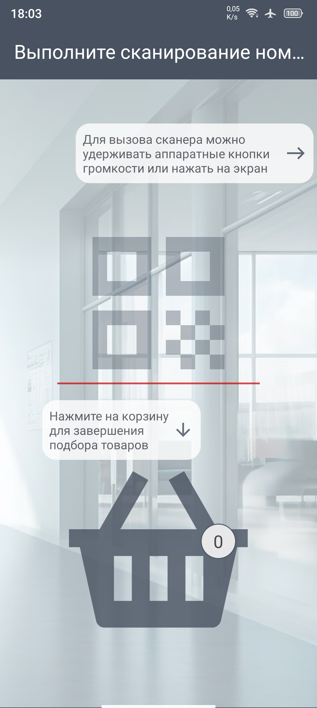
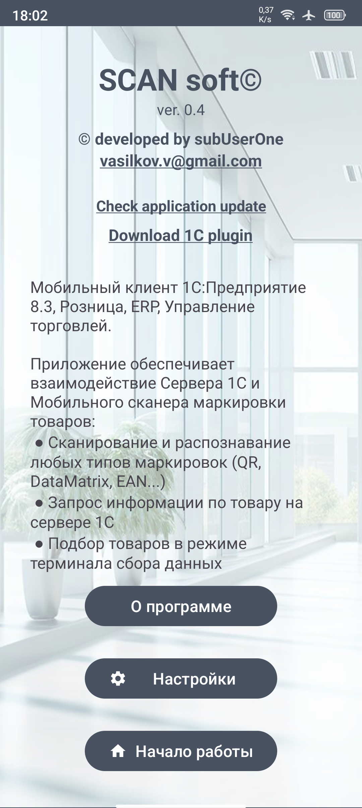

<h0>SCAN soft</h0>

<h1>Назначение</h1>

Приложение позволяет использовать мобильный телефон как терминал сбора данных (ТСД).
Доступны два режима работы:
<li>оффлайн режим (локальная база номенклатуры)</li>
<li>онлайн режим (подключение к серверу 1С)</li>

<h1>Настройка работы online режима</h1>

<h1>Работа приложения и сценарии использования</h1>

