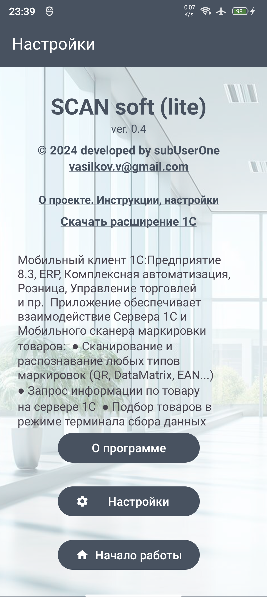
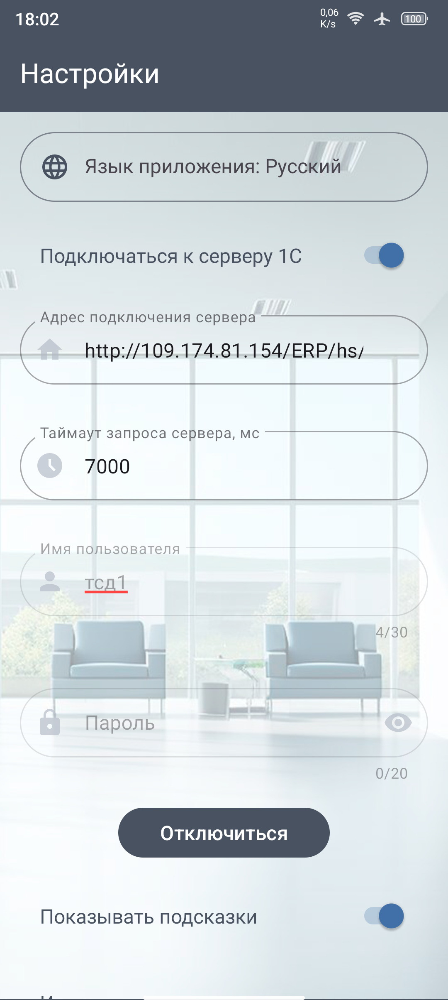
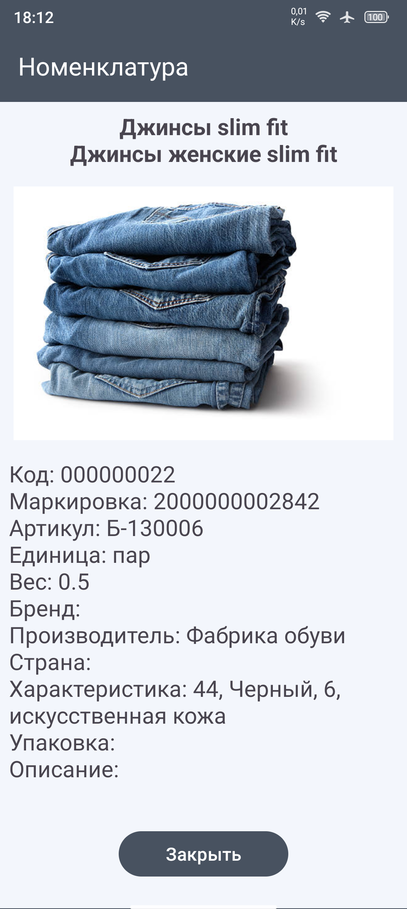
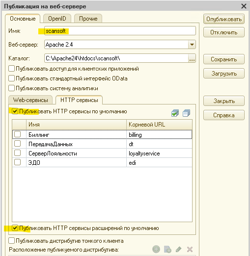
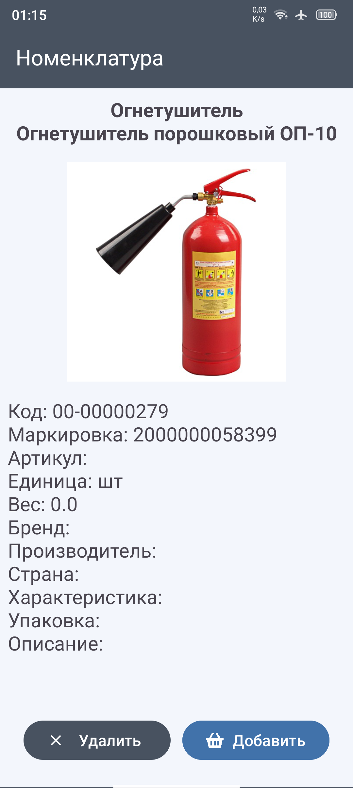
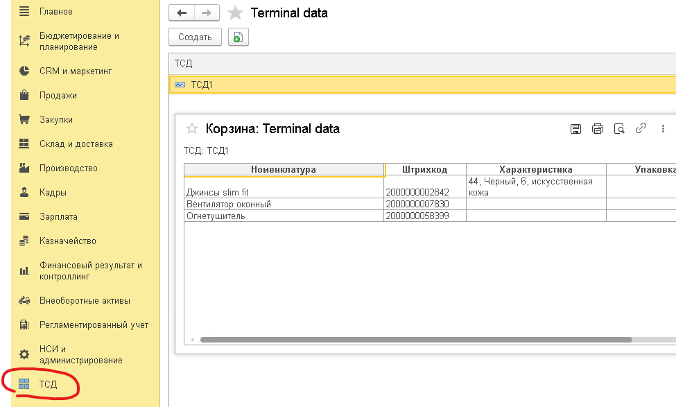

<h1>SCAN soft</h1>

<a href="https://github.com/subUserOne/ScanSoft/releases">Последний релиз</a>
<a href="/releases">Последний релиз</a>

<h2>Назначение</h2>

Приложение позволяет использовать мобильный телефон как терминал сбора данных (ТСД). 
  
Доступны два режима работы:
<li>offline режим (локальная база номенклатуры)</li>
<li>online режим (подключение к серверу 1С)</li>

В offline режиме приложение использует локальную базу данных для хранения справочника номенклатуры. 
Сканирование маркировки товаров выполняет поиск по локальной базе и предлагает добавить номенклатуру. 
В карточке номенклатуры можно ввести данные по товару, сделать и прикрепить фотографию. 
   
Последующее сканирование маркировки сможет найти товар в базе данных и добавить его в корзину.
  

 

<h2>Настройка работы online режима</h2>

  До начала работы с приложением следует установить расширение одной из типовых конфигураций: <a href="https://github.com/subUserOne/ScanSoft/tree/main/Extensions" target="_blank">ERP, Торговля, Розница, Комплексная автоматизация</a>

Для работы расширения понадобится установить web server и опубликовать сервис расширения с настройками:
   
Имя указанное в публикации должно быть в настройке "Адрес подключения сервера" 
<b>http://&lt;XXX.XXX.XXX.XXX&gt;/&lt;baseName&gt;/hs/mi</b> 
где &lt;XXX.XXX.XXX.XXX&gt; - адрес сервера 1С, локальный или в интернет. 
  &lt;baseName&gt; - имя публикации

Далее, на каждый подключаемый терминал необходимо создать собственного пользователя в 1С и авторизоваться на ТСД с помощью логина и пароля.

  

<h2>Работа приложения и сценарии использования</h2>

  Сканирование маркировки осуществляется с помощью аппаратных кнопок громкости или нажатием на экран.
  В обоих сценариях работы (offline/online) по данным маркировки выполняется поиск номенклатуры в базе данных, после чего появляется возможность добавить товар в корзину.  
    
  Содержимое корзины можно просмотреть и отредактировать нажав на изображение корзины.  
   

По кнопке записать произойдет передача данных ТСД на сервер 1С. 
Просмотреть корзину в разрезе терминалов можно в регистре сведений  
 

Возможны любые сценарии использования данных, такие как:
<li>Создание и наполнение документов</li>
<li>Выполнение инвентаризации</li>
<li>Печать чеков ККМ</li>
<li>Формирвание отчетов и т.д.</li>
  

